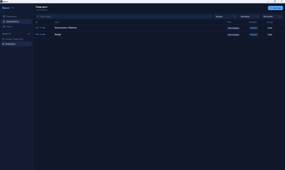
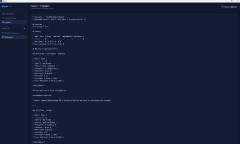

# Bacon

Desktop requirements and specification manager for AI-assisted development. This app was made with the help of AI (Claude - Anthropic).

**Stack:** Tauri v2 + React 19 + TypeScript + Tailwind CSS v4 + SQLite





## Prerequisites

- [Node.js](https://nodejs.org/) (v20+)
- [Rust](https://rustup.rs/) (stable)
- On Windows: [Visual Studio](https://visualstudio.microsoft.com/) with the **Desktop development with C++** workload

## Building locally

Use the provided PowerShell script to build a local installer:

```powershell
.\build.ps1           # debug build (default)
.\build.ps1 release   # release installer
```

The output installer will be in `src-tauri\target\<mode>\bundle\`.

## Development

```bash
npm install
npm run tauri dev
```

## Recommended IDE Setup

- [VS Code](https://code.visualstudio.com/) + [Tauri](https://marketplace.visualstudio.com/items?itemName=tauri-apps.tauri-vscode) + [rust-analyzer](https://marketplace.visualstudio.com/items?itemName=rust-lang.rust-analyzer)

## Windows + Git Bash: linker issue

If you build from **Git Bash** (not PowerShell or CMD), Git's `link.exe` (`C:\Program Files\Git\usr\bin\link.exe`) shadows MSVC's linker and causes a cryptic build failure.

**Recommended fix:** use `build.ps1` in PowerShell instead — Git Bash's PATH is not inherited there.

**Alternative fix:** create `src-tauri/.cargo/config.toml` (already gitignored) and point Cargo at the MSVC linker explicitly:

```toml
[target.x86_64-pc-windows-msvc]
linker = "C:/Program Files/Microsoft Visual Studio/<version>/Professional/VC/Tools/MSVC/<toolset>/bin/Hostx64/x64/link.exe"
```

Replace `<version>` and `<toolset>` with the values from your VS installation. You can find the correct path by running:

```powershell
Get-ChildItem "C:\Program Files\Microsoft Visual Studio" -Recurse -Filter "link.exe" |
    Where-Object { $_.FullName -match "Hostx64\\x64" }
```

## License
[License](LICENSE)